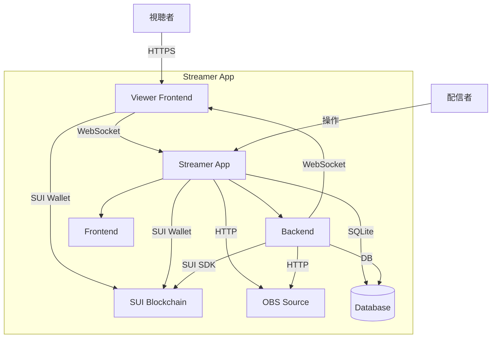

# SUIperCHAT

# SUIperCHAT (日本語)

[English description follows below.](#suiperchat-english)

**⚠️ 開発中のプロジェクト ⚠️**

本プロジェクトは現在開発中であり、仕様や機能は変更される可能性があります。

## 概要

SUIperCHATは、SUIブロックチェーンを活用した配信者向けスーパーチャットシステムです。YouTube等の既存プラットフォームでの配信に連携しながら、SUIを使用した独自の投げ銭システムを提供します。

## 主な機能

### 視聴者向け
- SUIウォレット連携によるスーパーチャット送信
- 金額選択 (送金なし、または1SUI/3SUI/5SUI/10SUIから選択)
- メッセージと表示名の設定
- シンプルな操作フロー

### 配信者向け
- OBSブラウザソースとの連携
- スーパーチャット表示のカスタマイズ
- 配信セッションごとのメッセージ・スパチャ履歴管理
- ローカルWebSocketサーバーによるリアルタイム表示
- Rust + Tauriによる軽量・セキュアなデスクトップアプリケーション

## アーキテクチャ

## 技術スタック

### 視聴者向けフロントエンド (viewer/)
- 言語: TypeScript
- フレームワーク: Next.js (React)
- UI: shadcn UI, Tailwind CSS
- ブロックチェーン連携: SUI TypeScript SDK (@mysten/dapp-kit)

### 配信者向けデスクトップアプリケーション (suiperchat_streamer_app/)
- **フレームワーク**: Tauri (Rust + WebView)
    - Rustバックエンド:
        - Webサーバー (WebSocket/HTTP): Actix Web
        - 非同期ランタイム: Tokio
        - データベース: SQLite (via SQLx)
        - 状態管理: `tauri::AppHandle`, `tauri::State`
    - WebViewフロントエンド:
        - 言語: TypeScript
        - フレームワーク: Next.js (React)
        - UI: shadcn UI, Tailwind CSS
        - Tauri連携: `@tauri-apps/api`

### スマートコントラクト (contract/)
- 言語: Move (Sui)

### その他
- パッケージマネージャー: npm
- フォーマッター/リンター: Biome

## セットアップ

配信者向けセットアップは [こちら](./suiperchat_streamer_app/README.md) を参照してください。
視聴者向けセットアップは [こちら](./viewer/README.md) を参照してください。
スマートコントラクトのデプロイについては [こちら](./contract/README.md) を参照してください。

## ロードマップ

- [ ] カスタム金額設定オプション
- [ ] 配信プラットフォームAPI連携（YouTube, Twitchなど）
- [ ] 詳細な分析・集計機能

## ライセンス

本プロジェクトは [MIT License](LICENSE) の下で公開されています。

---

# SUIperCHAT (English)

**⚠️ Project Under Development ⚠️**
This project is currently under development, and specifications or features may change.

## Overview

SUIperCHAT is a Super Chat system for streamers utilizing the SUI blockchain. It provides a unique tipping system using SUI while integrating with streams on existing platforms like YouTube.

## Key Features

### For Viewers
- Send Super Chats via SUI wallet integration.
- Select amount (no sending, or choose from 1 SUI / 3 SUI / 5 SUI / 10 SUI).
- Set message and display name.
- Simple operation flow.

### For Streamers
- Integration with OBS browser source.
- Customize Super Chat display.
- Manage message/Super Chat history per stream session.
- Real-time display via local WebSocket server.
- Lightweight and secure desktop application powered by Rust + Tauri.

## Architecture

## Tech Stack

### Viewer Frontend (viewer/)
- Language: TypeScript
- Framework: Next.js (React)
- UI: shadcn UI, Tailwind CSS
- Blockchain Integration: SUI TypeScript SDK (@mysten/dapp-kit)

### Streamer Desktop Application (suiperchat_streamer_app/)
- **Framework**: Tauri (Rust + WebView)
    - Rust Backend:
        - Web Server (WebSocket/HTTP): Actix Web
        - Async Runtime: Tokio
        - Database: SQLite (via SQLx)
        - State Management: `tauri::AppHandle`, `tauri::State`
    - WebView Frontend:
        - Language: TypeScript
        - Framework: Next.js (React)
        - UI: shadcn UI, Tailwind CSS
        - Tauri Integration: `@tauri-apps/api`

### Smart Contract (contract/)
- Language: Move (Sui)

### Others
- Package Manager: npm
- Formatter/Linter: Biome

## Setup

For streamer setup, please refer to [here](./suiperchat_streamer_app/README.md).
For viewer setup, please refer to [here](./viewer/README.md).
For smart contract deployment, please refer to [here](./contract/README.md).

## Roadmap

- [ ] Custom amount setting option
- [ ] Streaming platform API integration (YouTube, Twitch, etc.)
- [ ] Detailed analytics and aggregation features

## License

This project is licensed under the [MIT License](LICENSE).
