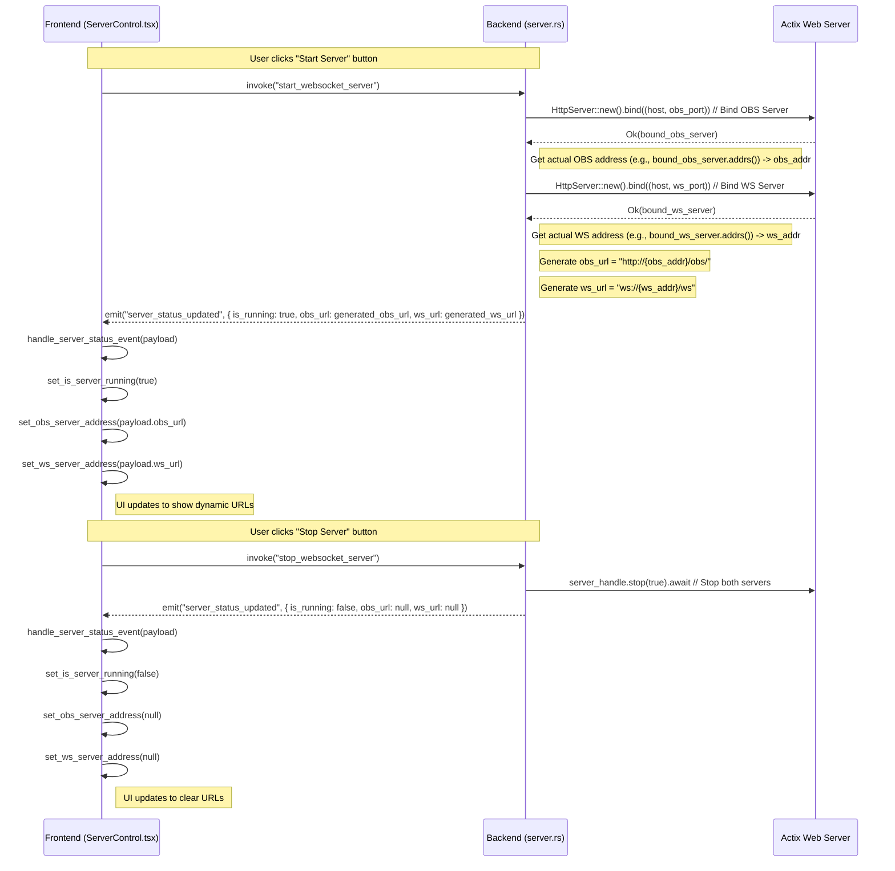

# OBS用URL動的表示 改善計画

## 問題点

-   OBS用ブラウザソースのURL (`http://127.0.0.1:8082/obs/`) が真っ白なページになる。
    -   原因1: OBS用HTTPサーバーはポート `8081` で起動する設計になっているため、アクセスするポートが異なる。
    -   原因2: サーバー自体が起動していない可能性がある。
-   TauriアプリのUI (`ServerControl.tsx`) で表示されるサーバーアドレスがハードコードされている。

## 改善目標

1.  OBS用URL (`http://127.0.0.1:8081/obs/`) が正しく表示されるようにする（サーバー起動が前提）。
2.  TauriアプリのUIに、実際にサーバーがリッスンしている動的なOBS用URLとWebSocket用URLを表示する。

## 計画概要

1.  **バックエンド (`server.rs`) の修正:**
    *   `start_websocket_server` コマンド内で、Actix Web サーバーが実際にリッスンを開始したアドレスとポート番号を取得する。
    *   取得した情報から、完全な OBS 用 URL (`http://<ip>:<port>/obs/`) と WebSocket URL (`ws://<ip>:<port>/ws`) を生成する。
    *   サーバー起動成功時にフロントエンドへ送信する `server_status_updated` イベントのペイロードを更新し、生成したURLを含める (例: `{ is_running: true, obs_url: "...", ws_url: "..." }`)。停止時も同様に `null` を含める。
2.  **フロントエンド (`ServerControl.tsx`) の修正:**
    *   `server_status_updated` イベントのリスナー (`handle_server_status_event`) で、イベントペイロードから動的に取得した OBS 用 URL と WebSocket URL を受け取る。
    *   受け取った URL をコンポーネントの State (`obs_server_address`, `ws_server_address`) に設定し、UI表示を更新する。

## 計画詳細 (シーケンス図)

## 次のステップ

1.  この計画ファイルを保存する。
2.  `code` モードに切り替えて、バックエンド (`server.rs`) の修正を開始する。
3.  フロントエンド (`ServerControl.tsx`) の修正を行う。
4.  動作確認を行う。