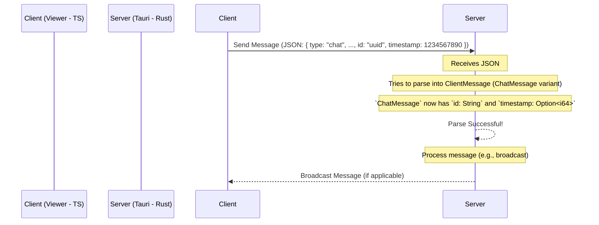

# WebSocket メッセージパースエラー修正計画

## 1. 問題概要

サーバー側のログにて、クライアントから受信したWebSocketメッセージのパースに失敗するエラーが記録されている。

**エラーログ:**
```
メッセージのパースに失敗: data did not match any variant of untagged enum ClientMessage, 受信内容: {"type":"chat","display_name":"aaa","message":"zzz","id":"2da9d5f8-4863-4c71-9927-d05d4cab648a","timestamp":1745065633043}
```

## 2. 原因分析

クライアント (TypeScript) とサーバー (Rust/Tauri) 間で送受信されるWebSocketメッセージの形式に不一致がある。

*   **クライアント送信データ:**
    *   `id`: `crypto.randomUUID()` で生成された文字列
    *   `timestamp`: `Date.now()` で生成された数値 (Unixタイムスタンプミリ秒)
*   **サーバー側 (`types.rs`) `ChatMessage` 期待形式:**
    *   `id` フィールドが存在しない
    *   `timestamp` フィールドが `Option<String>`

この `id` フィールドの有無と `timestamp` の型不一致により、サーバー側の `serde` によるデシリアライズ (`#[serde(untagged)]`) が失敗している。

クライアント側の型定義 (`viewer/src/lib/types/websocket.ts`) は、送信データと一致しており、修正は不要。

## 3. 修正計画

サーバー側の型定義をクライアント側の形式に合わせて修正する。

**対象ファイル:** `suiperchat_streamer_app/src-tauri/src/types.rs`

**修正内容:**

1.  **`ChatMessage` 構造体:**
    *   `pub id: String,` フィールドを追加する。
    *   `pub timestamp: Option<String>,` を `pub timestamp: Option<i64>,` に変更する。
2.  **`SuperchatMessage` 構造体:**
    *   `pub id: String,` フィールドを追加する。
    *   `pub timestamp: Option<String>,` を `pub timestamp: Option<i64>,` に変更する。
3.  **テストコード (`#[cfg(test)] mod tests`):**
    *   `ChatMessage` および `SuperchatMessage` を生成するテストデータに `id` フィールドを追加する。
    *   `timestamp` のアサーションを数値 (`i64`) ベースの比較に変更する。
    *   フロントエンド互換性テスト (`test_frontend_compatibility`) のJSONサンプルに `id` と数値の `timestamp` を追加し、パースが成功することを確認する。

**修正後のデータフロー (イメージ):**



## 4. 次のステップ

*   `code` モードに切り替えて、上記計画に基づき `suiperchat_streamer_app/src-tauri/src/types.rs` を修正する。
*   修正後、ビルドと動作確認を行う。